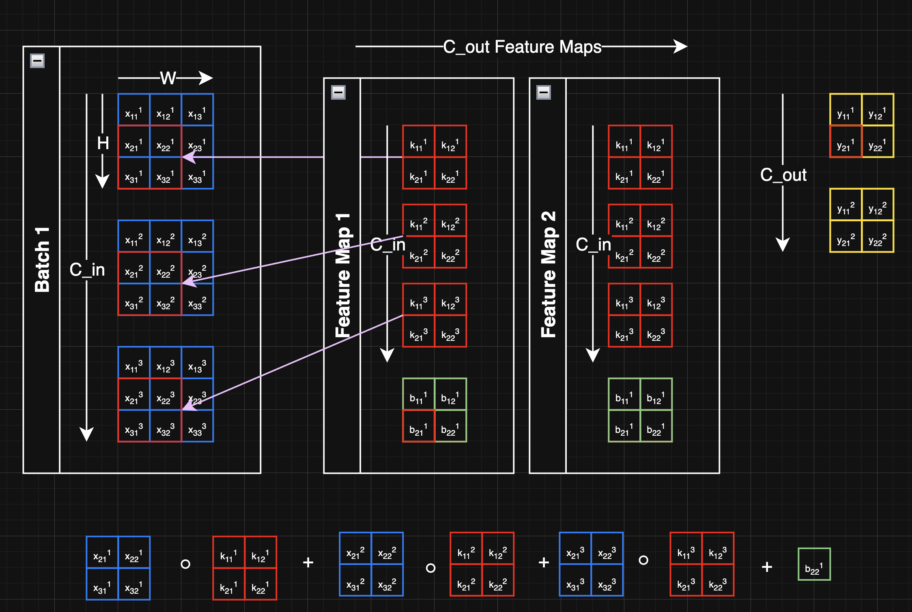
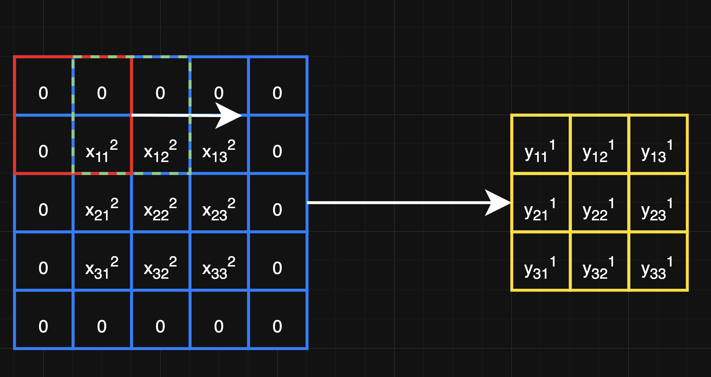
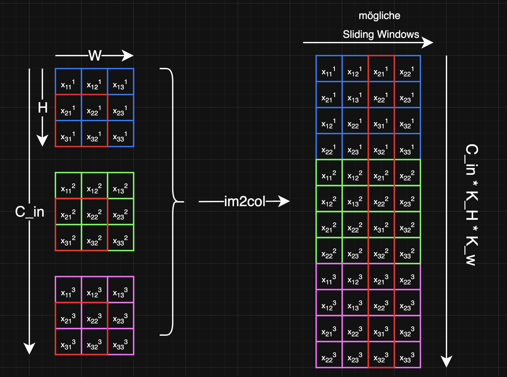
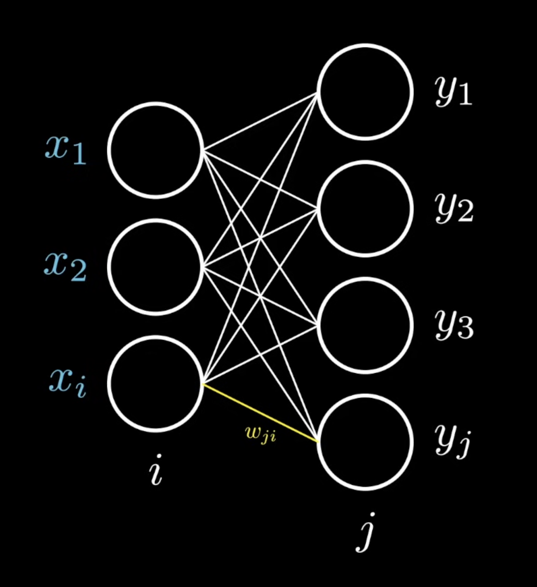
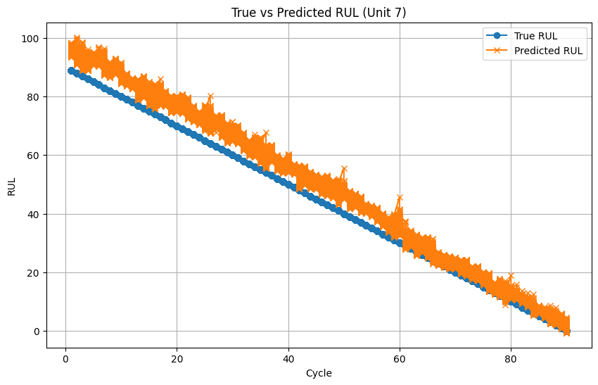

# Dokumentation - RUL Estimation for Turbofan Engines using Deep Learning

Authors: *Christoph Gahabka, Levin Singler, Jonathan Remus*

**Datum**: 2026-02-23

*Diese Dokumentation ist ebenfalls als PDF im root unter der Datei ```Dokumentation.pdf``` vorzufinden*

### Inhaltsverzeichnis

- [Thema-Einleitung](#Thema-Einleitung)
- [Zielsetzung-Idee](#Zielsetzung-Idee)
- [Projektstruktu](#Projektstruktur)
- [Dataset-Overview-Umweltwissen](#Dataset-Overview-Umweltwissen)
- [Modul-Beschreinung](#modul-beschreibung)
- [Konfiguration](#Konfiguration)
- [CNN-Model](#CNN-Model)
    - [Architektur](#Architektur)
    - [Custom-Layer-Implementierung](#Custom-Layer-Implementierung)
    - [Training](#Training)
    - [Ergebnisse/Plotting](#Ergebnisse)
- [LSTM-Model](#LSTM-Model)
- [Vergleich CNN vs. LSTM](#vergleich-cnn-lstm)
- [Datenanalyse](#Datenanalyse)
- [Quellen/Hilfsmittel](#Quellen-und-Hilfsmittel)

## Zielsetzung

Ich schreibe die Einleitung basierend auf den beiden Papers und dem Kaggle-Dataset.

---

## Einleitung

Die Vorhersage der verbleibenden Nutzungsdauer (im Englischen **Remaining Useful Life** (RUL)) ist eines der zentralen Themen im Bereich *Predictive Maintenance* und *Prognostics and Health Management* (PHM). Ziel ist es, möglichst zuverlässig abzuschätzen, wie lange eine Komponente oder ein System noch funktionsfähig bleibt, bevor ein Ausfall eintritt. Dadurch lassen sich ungeplante Stillstände vermeiden, Wartungsmaßnahmen gezielt planen und die Betriebssicherheit erhöhen. Besonders in sicherheitskritischen Bereichen wie der Luftfahrt ist das von enormer Bedeutung: Ein Triebwerksausfall verursacht nicht nur hohe Kosten, sondern kann im Ernstfall direkte Auswirkungen auf die Flugsicherheit haben.

Als Datengrundlage dient in diesem Programmentwurf der **N-CMAPSS-Datensatz** (*New Commercial Modular Aero-Propulsion System Simulation*) der NASA. Dabei handelt es sich um synthetisch erzeugte *Run-to-Failure*-Trajektorien einer kleinen Flotte von Turbofan-Triebwerken, die unter realitätsnahen Flugbedingungen simuliert wurden. Die Simulation basiert auf echten Flugprofilen eines kommerziellen Jets und bildet typische Flugphasen wie Start, Steigflug, Reiseflug und Sinkflug vollständig ab. Besonders hervorzuheben ist, dass der Degradationsprozess direkt an die jeweilige Betriebshistorie gekoppelt ist. Dadurch entstehen Daten, die dem realen Verhalten von Triebwerken deutlich näherkommen als rein abstrakte Simulationen. Pro Triebwerkseinheit stehen Messungen von 14 Sensoren, 4 Betriebsbedingungen sowie 14 virtuellen Sensoren zur Verfügung, aufgezeichnet mit einer Abtastrate von 1 Hz.

Grundsätzlich lassen sich zwei Ansätze zur RUL-Schätzung unterscheiden: **modellbasierte** und **datengetriebene Verfahren**. Modellbasierte Methoden greifen auf physikalisches Domänenwissen zurück und beschreiben den Verschleiß mithilfe expliziter Degradationsmodelle. Bei hochkomplexen Systemen wie Flugtriebwerken stoßen solche Ansätze jedoch schnell an Grenzen. Datengetriebene Methoden hingegen lernen Muster direkt aus Sensordaten. Sie profitieren von der zunehmenden Verfügbarkeit großer Datensätze und der stetig wachsenden Leistungsfähigkeit moderner Deep-Learning-Architekturen. In der Literatur haben sich insbesondere **Convolutional Neural Networks (CNN)** und **Long Short-Term Memory Netzwerke (LSTM)** als leistungsfähig erwiesen, da sie lokale Muster beziehungsweise zeitliche Abhängigkeiten in Sensorzeitreihen effektiv erfassen können.

Im Rahmen dieses Programmentwurfs werden beide Architekturen auf dem N-CMAPSS-Datensatz implementiert, trainiert und miteinander verglichen, um eine Lösung für das RUL-Problem zu entwickeln.  Damit wird der Kerngedanke eines datenbasiereten, intelligenten Systems zur vorausschauenden Wartung anschaulich veranschaulicht.

## Projektstruktur
Das Projekt ist bewusst modular aufgebaut, um eine klare Trennung zwischen Datenverarbeitung, Modelllogik und Analyse zu gewährleisten. Der gesamte wiederverwendbare Code ist in einem eigenen src/-Paket gebündelt, sodass die einzelnen Notebooks lediglich die Hauptfunktionen und Code-Blöcke enthalten. 

```md
projekt/
├── config.py                  <- Parameter, Paths, Hyperparameter
├── datasets/                  <- N-CMAPSS HDF5-Files
├── models/                    <- saved checkpoints
├── src/
│   ├── data_loader.py         <- Loading, Normalisation, Dataset creation
│   └── cnn.py                 <- Model loading, Evaluation
├── cnn_model.ipynb            <- CNN Training & Demo
├── lstm_model.ipynb           <- LSTM Training & Demo
├── data_analysis.ipynb        <- EDA, Visualisations
└── overview.ipynb             <- Overview of findings
```

#### **config**
- enthält globale Variablen wie file path und trainings-parameter

**datasets/**
- enthält alle verwendeten Datasets im **HDF5-Format**

**models/**
- enthält die **trainierten Modelle** im .pth-Format, je nach unterschiedlichen Parametern

## Dataset-Overview


## Modul-Beschreibung
```md
├── src/data_loader.py
│   ├── load_data()
│   ├── normalize_data()
│   └── create_testing_and_training_sets()
└── src/cnn.py
    ├── load_model()
    ├── evaluate_test_loss()
    └── mse_torch()
```

### **src/data_loader**

#### **load_data()**
- Laden von HDF5 files
- droppen von irrelevanten columns
- concatenation von relevanten columns
- Erstellen von initialem Training und Testing Dataset

#### **normalize_data()**
- Normalisierung der Trainings- und Testdaten mittels StandardScaler von scikit-learn
- basierend auf der **Z-Score Normalisierung:** $$z = \frac{x - \mu}{\sigma}$$ mit dem **arithmetischen Mittel:** $$\mu = \frac{1}{N} \sum_{i=1}^{N} x_i$$ und der **Standardabweichung:** $$
\sigma = \sqrt{ \frac{1}{N} \sum_{i=1}^{N} (x_i - \mu)^2 }$$ mit 
$$
x_i \in \mathbb{R}^{m}, \quad i = 1, \dots, n
$$

#### **create_training_and_testing_dataset**

- **Input**: skalierte Trainings- und Testdaten (df_training_scaled, df_testing_scaled), wobei:

$$
X_\text{unit} \in \mathbb{R}^{n \times m}
$$

- $n$ = Anzahl Messpunkte (Zeilen / Rows)
- $m$ = Anzahl der Features pro Zeitschritt (Sensorwerte / Columns / Spalten)

- **Funktion:**

    - Erzeugt aus den Zeitreihendaten **Sliding Windows** der Länge win_len

    - Teilt **Features (X)** und **Labels (y)** auf (Label = RUL am letzten Zeitschritt des Fensters)
    - Für alle Units zusammen ergeben sich die Trainings- bzw. Testdatensätze als **Sammlung von Fenstern:**

    $$
    X_\text{train} \in \mathbb{R}^{\text{num\_windows} \times \text{win\_len} \times m}, \quad
    $$
    $$
    X_\text{test} \in \mathbb{R}^{\text{num\_windows} \times \text{win\_len} \times m}
    $$

    - Wandelt die Daten in **PyTorch Tensors** um 

        (PyTorch Tensor = n-Dimensionales Array, unterstützt autograd (automatische Ableitungen) für Backpropagation, CPU/GPU optimiert)


    - Erstellt **DataLoader** für Training und Test mit Batch-Größe batch_size $$X_\text{train} \in \mathbb{R}^{\text{num\_windows} \times \text{1}\times \text{win\_len} \times m}, \quad$$ $$X_\text{test} \in \mathbb{R}^{\text{num\_windows} \times \text{1}\times \text{win\_len} \times m}, \quad$$ 
    mit $win\_len = 10$ und $m = 36$
    

- **Output:** train_loader, test_loader (PyTorch DataLoader für Trainings- und Testdaten)

### **src/cnn.py**
- Hilfsfunktionen für das CNN-Modell

#### **load_model()**
- **Input**: model (nn.Sequential), checkpoint_path (str), device (torch.device)
- Lädt einen gespeicherten Modell-Checkpoint aus einer `.pth` Datei
- Überträgt die gespeicherten Gewichte in das Modell via `load_state_dict()`
- Verschiebt das Modell auf das angegebene Device (CPU / MPS / GPU)
- Setzt das Modell in den Evaluierungsmodus (`model.eval()`)
- **Output**: model (nn.Module, bereit für Inference)

#### **evaluate_test_loss()**
- **Input**: model, device, test_loader (PyTorch DataLoader)
- Führt Inference (model.forward()) über den gesamten Testdatensatz durch ohne Gradientenberechnung (`torch.no_grad()`)
- Berechnet den durchschnittlichen **MSE** über alle Batches
- Berechnet **R²-Score** und **Accuracy** via scikit-learn
- **Output**: Tuple aus (avg_loss, r2, accuracy)

#### **mse_torch()**
- **Input**: y_true, y_pred (torch.Tensor)
- Berechnet den **Mean Squared Error** zwischen vorhergesagten und tatsächlichen RUL-Werten
- Eigene PyTorch-Implementierung der MSE-Verlustfunktion, genutzt während Training und Evaluation
- **Formel:**$$\text{MSE} = \frac{1}{N} \sum_{i=1}^{N} (y_i - \hat{y}_i)^2$$
  mit $y_i$ als tatsächlichem RUL-Wert und $\hat{y}_i$ als vorhergesagtem RUL-Wert
- **Output**: skalarer Tensor (Durchschnittlicher quadratischer Fehler)


## Konfiguration

(config.py)

Alle zentralen Parameter des Projekts sind in der `config.py` gebündelt, sodass Anpassungen an genau einer Stelle vorgenommen werden können, ohne in den einzelnen Notebooks suchen zu müssen:

| Variable | Wert | Beschreibung |
|---|---|---|
| `FILENAME` | `"...N-CMAPSS_DS02-006.h5"` | Pfad zur Datei der verwendeten N-CMAPSS-Daten |
| `CHECKPOINT_PATH` | `"network_checkpoint4.pth"` | Pfad zum gespeicherten Modell-Checkpoint |
| `AUTOSAVE_EVERY` | `500` | Automatisches Speichern alle $n$ Batches |
| `EPOCHS` | `10` | Anzahl der Trainingsepochen |
| `LEARNING_RATE` | `0.0001` | Lernrate des Adam-Optimizers |
| `BATCH_SIZE` | `256` | Anzahl der Samples pro Trainingsschritt |
| `WIN_LEN` | `10` | Länge des Sliding Window in Zeitschritten |
| `LOAD_MODEL` | `True` | Vortrainiertes Modell laden statt komplett neu trainieren |

## CNN-Modell

Ein CNN ist eine spezielle Architektur neuronaler Netze, bei der anstelle vollverbundener Schichten (Dense Layer) sogenannte Convolutional Layer zum Einsatz kommen. Ein lernbarer Kernel gleitet dabei über die Eingabe und extrahiert lokale Merkmale, in Bildern beispielsweise Kanten oder Texturen, in diesem RUL-Problem charakteristische Muster im Degradationsverlauf der Sensoren eines Triebwerkes.

### Architektur

Das CNN nimmt als Eingabe ein Sliding Window der Form `(B, 1, 10, 36)` entgegen, welches zuvor aus [create_dataset](#create_training_and_testing_dataset) erstellt wurde, wobei:
- `B` - Batch Size (Anzahl gleichzeitig verarbeiteter Samples bzw. "Windows": 256 in [config.py](#config)
- `1` - Anzahl der Eingangskanäle
- `10` - Fensterlänge in Zeitschritten (`WIN_LEN`)
- `36` - Anzahl der Feature-Spalten pro Zeitschritt

Das Modell ist als `nn.Sequential` aufgebaut. 

`nn.Sequential`ermöglicht das stacken von Layers, um schlussendlich eine "Pipeline" zu erstellen, welche die Daten durchlaufen.
Dabei werden folgende Schichten durchlaufen: 

| Index | Layer | Parameter | Output-Shape |
|---|---|---|---|
| 0 | `CustomConv2d` | 1 -> 64 Filter,  k=3, p=1 | (B, 64, 10, 36) |
| 1 | `BatchNorm2d` | 64 Kanäle | (B, 64, 10, 36) |
| 2 | `CustomLeakyReLU` | a = 0.01 | (B, 64, 10, 36) |
| 3 | `CustomConv2d` | 64 -> 64 Filter, k=3, p=1 | (B, 64, 10, 36) |
| 4 | `BatchNorm2d` | 64 Kanäle | (B, 64, 10, 36) |
| 5 | `CustomLeakyReLU` | a = 0.01 | (B, 64, 10, 36) |
| 6 | `CustomConv2d` | 64 -> 64 Filter, k=3, p=1 | (B, 64, 10, 36) |
| 7 | `BatchNorm2d` | 64 Kanäle | (B, 64, 10, 36) |
| 8 | `CustomLeakyReLU` | a = 0.01 | (B, 64, 10, 36) |
| 9 | `AdaptiveAvgPool2d` | output=(1,1) | (B, 64, 1, 1) |
| 10 | `CustomFlatten` |  | (B, 64) |
| 11 | `CustomDense` | 64 -> 64 | (B, 64) |
| 12 | `CustomLeakyReLU` | a = 0.01 | (B, 64) |
| 13 | `CustomDense` | 64 -> 1 | (B, 1) |

<br>
Der Ablauf pro Epoche, pro Batch ist wie folgt:

<br>

```text
        +-------------------+
        |      Forward      |
        |       Pass        |
        +---------+---------+
                  |
                  | 
                  v
        +---------+---------+
        |       Loss        |
        |     Funktion      |
        +---------+---------+
                  |
                  | 
                  v
        +---------+---------+
        |    Gradienten     |
        |    Berechnung /   | 
        |   Backward Pass   |
        +---------+---------+
                  |
                  | 
                  v
        +---------+---------+
        |      Gewichte     |
        |      updaten      |
        +---------+---------+
```

```python
# Cost- / Loss-Funktion
loss: Tensor = mse_torch(y_batch, output)

# L2-Regularisierung
l2_lambda: float = 1e-2
l2_norm = 0.0
for name, param in model.named_parameters():
    if param.requires_grad and "bias" not in name:
        l2_norm += torch.sum(param.pow(2))

loss = loss + l2_lambda * l2_norm

# Backward Pass / Gradientenberechnung
loss.backward()

previous_loss = loss.item()

# Update der Gewichte
optimizer.step()
```

In der Forward-Propagation durchläuft das Modell die Layers in der obigen Reihenfolge:

Dazu gehören drei Blöcke aus **Conv2d → BatchNorm2d → LeakyReLU**. Diese extrahieren die Feature-Maps, normalisieren sie und ermöglichen dem Modell durch die nichtlineare Aktivierung, komplexe Strukturen zu lernen. Anschließend transformiert der **Adaptive Average Pooling Layer** die Ausgabe in eine kompaktere Form, die vom **Flatten Layer** in einen eindimensionalen Vektor transformiert wird. Dieser Vektor wird schließlich durch die Dense Layer weiterverarbeitet, um das finale Ergebnis zu erzeugen.

Dann wird der Loss auf Basis dieses Outputs berechnet sowie die L2-Regularisierung auf alle Layers angewendet.

Daraufhin folgt mit `loss.backward()` die **Backward-Propagation**, wo der Prozess einmal umgekehrt wird:

Ausgehend vom Gradienten des Outputs bezüglich des Fehlers ($\frac{\partial L}{\partial \mathbf{Y}}$) werden die Gradienten rückwärts durch das Netzwerk propagiert, sodass die Parameter auf dieser Basis daraufhin angepasst werden können in `optimizer.step()`.
---

### Custom-Layer-Implementierung

Im folgenden werden die selbst implementierten Layer von der Architektur sowie von der Mathematik hergeleitet und erklärt.

#### **Conv2d Layer**

Gegeben sei eine **Input-Matrix** mit 
$$
X \in \mathbb{R}^{B \times C_{\text{in}} \times H \times W}
$$
$$
\text{mit} \ H = \text{window length}
$$
$$
\text{und} \ W = \text{number of columns}
$$
und eine kleine Matrix mit lernbaren Parametern / Gewichten
$$
K \in \mathbb{R}^{C_{\text{out}} \times C_{\text{in}} \times K_{\text{H}} \times K_{\text{W}}}
$$
auch Kernel oder Filter genannt. Jeder Kernel soll **spezifische Muster / Merkmale** in der Input-Matrix finden und mit seinen Gewichten darstellen. Hierbei ist die Größe der quadratischen Matrix ein **trainierbarer Hyperparameter**.

Die sog. **"Convolution"** ist eine Operation auf der Input-Matrix, die das Verschieben eines gespiegelten Kernels über die Eingabedaten umfasst. Dabei wird das Skalarprodukt zwischen den Parametern im Kernel und der Werte der Input-Matrix an der Position des Kernels berechnet. Diese Operation erzeugt eine *"feauture Map"*, welche in der Input-Matrix erkannte Merkmale darstellt.


Abb. 1: Beispiel einer Cross-Correlation sowie der Dimensionen – vereinfachte Berechnung von $Y_{21}^{1}$

<br>
CNNs finden primär Anwendung in der Bildverarbeitung. Dieses Projekt zeigt jedoch, dass sie sich ebenso für Zeitreihendaten eignen. In Bildern ist Convolution vorteilhaft, weil ein Kernel stets mehrere benachbarte Pixel gleichzeitig betrachtet und so lokale Muster erkennt. Derselbe Mechanismus lässt sich auf Zeitreihendaten übertragen: Zusammenhänge in Sensordaten zeigen sich in ihrer zeitlichen Entwicklung und genau diese lokale Struktur arbeitet der Kernel heraus.

---

**weitere Begrifflichkeiten**:

**Stride:**
- entscheidet über die Bewegung des Kernels: $stride = 1$ entspricht einer Bewegung von einer Einheit. In der Abb. 1 ist ein stride = 1 durch den roten Kasten und dem gestrichelten blauen Kasten verdeutlicht.

**Padding:**
- ist die Erweiterung des Randes der Input-Matrix mit Nullen. Bei der Convolution wird der Kernel über die Input-Matrix geschoben, wobei sich hier ohne Padding der Output verkleinert. Mit zero padding = 1 und einer Kernel-Size von 3 x 3, bleibt somit die Größe der Input-Matrix erhalten. 


Abb. 2 (selbst erstellt): Zero-Padding und stride=1

---

##### **Forward Pass**

Die allgemeine Forward-Propagation eines Convolutional Layers lautet:

$$\mathbf{Y} = \mathbf{X} \star \mathbf{K} + \mathbf{B}$$

wobei $\mathbf{X}$ die Eingabe, $\mathbf{K}$ der Kernel (Weights), $\mathbf{b}$ der Bias 
und $\star$ die Cross-Correlation bezeichnet.


Anzumerken ist, dass bei CNNs häufig die **Cross-Correlation** anstelle der mathematischen **Convolution** verwendet wird. 
Der Unterschied besteht lediglich darin, dass bei der *Cross-Correlation* der Kernel nicht gespiegelt wird. 
Dies vereinfacht die Implementierung und ist recheneffizienter, ohne die Lernfähigkeit des Modells einzuschränken.

###### **Cross-Correlation**
Die zugrunde liegende Operation lautet:

$$(\mathbf{X} \star \mathbf{W})_{i,j} = \sum_{m} \sum_{n} \mathbf{X}_{i+m,\,j+n} \mathbf{W}_{m,n}$$

Eine native Implementierung dieser Operation würde verschachtelte `for`-Schleifen über alle räumlichen 
Positionen und Kernelindizes erfordern und wäre damit ineffizient. Stattdessen wird die sogenannte 
**im2col-Technik** verwendet, um die Cross-Correlation als Matrixmultiplikation darzustellen.

```python
x_col = F.unfold(
        x,
        kernel_size=(K_h, K_w),
        padding=padding,
        stride=stride
    )
```

Hierfür wird die Eingabe $\mathbf{X} \in \mathbb{R}^{B \times C_{in} \times H \times W}$ mithilfe von 
`torch.nn.functional.unfold` in eine Patch-Matrix transformiert. Dabei werden alle lokalen Kernelbereiche 
extrahiert, flach dargestellt und als Spalten nebeneinander angeordnet:

$$\mathbf{X}_{col} \in \mathbb{R}^{B \times (C_{in} K_h K_w) \times L}$$

mit

$$L = H_{out} \cdot W_{out}$$

Jede der $L$ Spalten entspricht dabei einem lokal betrachteten Eingabepatch der Größe 
$C_{in} \times K_h \times K_w$, das zu einem Vektor der Länge $C_{in} K_h K_w$ abgeflacht wird.

Parallel dazu werden die  Kernels

$$\mathbf{W} \in \mathbb{R}^{C_{out} \times C_{in} \times K_h \times K_w}$$

zu einer Matrix

$$\mathbf{W}_{flat} \in \mathbb{R}^{C_{out} \times (C_{in} K_h K_w)}$$

umgeformt. 

```python
weight_flat = weight.view(C_out, C_in * K_h * K_w)
```

Die eigentliche Cross-Correlation kann nun als Matrixmultiplikation berechnet werden:

$$\mathbf{Y}_{flat} = \mathbf{W}_{flat} \cdot \mathbf{X}_{col}$$
```python
out = weight_flat @ x_col
```

Da über die Batches iteriert wird, kann die Batch-Dimension $B$ vernachlässigt werden. 
Die Matrixmultiplikation reduziert sich damit auf:

$$\mathbf{W}_{flat} \cdot \mathbf{X}_{col} \;=\; 
\mathbb{R}^{C_{out} \times (C_{in} K_h K_w)} \cdot \mathbb{R}^{(C_{in} K_h K_w) \times L} 
\;=\; \mathbb{R}^{C_{out} \times L}$$

Die inneren Dimensionen $(C_{in} K_h K_w)$ stimmen überein, womit die Matrixmultiplikation definiert ist.

Das Ergebnis besitzt die Form $\mathbb{R}^{B \times C_{out} \times L}$ und wird anschließend wieder 
in die räumliche Struktur zurückgeformt:
$$\mathbb{R}^{B \times C_{out} \times H_{out} \times W_{out}}$$


Abb. 3: im2col Technik

###### **Bias**

Der Bias wird nach:
$$\mathbf{Y} = \mathbf{X} \star \mathbf{K} + \mathbf{B}$$
lediglich addiert. Dafür muss er nur in die passende Form gebracht werden.
Aus $\mathbf{b} \in \mathbb{R}^{C_{out}}$ wird $\mathbf{b} \in \mathbb{R}^{B \times C_{out} \times L}$
```python
out = out + bias.view(1, C_out, 1)
```
`view(1, C_out, 1)` reshaped den Bias auf $\mathbb{R}^{B \times C_{out} \times L}$. `C_out` stimmt über ein, `1` bedeutet, dass diejenige Dimension passend gestreckt wird.

Abschließend wird der Output noch passend reshaped. Die Ausgabedimensionen berechnen sich aus 
Eingabegröße, Padding, Kernelgröße und Stride:

$$H_{out} = \left\lfloor \frac{H + 2 \cdot \text{padding} - K_h}{\text{stride}} \right\rfloor + 1$$

$$W_{out} = \left\lfloor \frac{W + 2 \cdot \text{padding} - K_w}{\text{stride}} \right\rfloor + 1$$

womit der finale Output die Form

$$\mathbf{Y} \in \mathbb{R}^{B \times C_{out} \times H_{out} \times W_{out}}$$

annimmt.

---

##### **Backward Pass**

ist dafür verantwortlich, die Gradienten durch das Netzwerk zurückzupropagieren und die Gewichte entsprechend anzupassen. Gegeben sei der Gradient des Fehlers $E$ bezüglich des Outputs $\mathbf{Y}$, also 
$\frac{\partial E}{\partial \mathbf{Y}}$. Auf dieser Basis müssen drei Gradienten berechnet werden:

- $\frac{\partial E}{\partial \mathbf{K}}$: um die **Kernelgewichte** zu aktualisieren
- $\frac{\partial E}{\partial \mathbf{b}}$: um den **Bias** zu aktualisieren  
- $\frac{\partial E}{\partial \mathbf{X}}$: um den Gradienten an die **vorherige Schicht** weiterzugeben

Da der Forward Pass als Matrixmultiplikation $\mathbf{Y}_{flat} = \mathbf{W}_{flat} \cdot \mathbf{X}_{col}$ formuliert wurde, lassen sich alle drei Gradienten direkt mittels Ableitungsregeln der Matrixmultiplikation ableiten. Für $\mathbf{Y} = \mathbf{W} \cdot \mathbf{X}$ 
gilt:

$$\frac{\partial E}{\partial \mathbf{W}} = \frac{\partial E}{\partial \mathbf{Y}} \cdot \mathbf{X}^{\top}$$

Eingesetzt in die im2col-Darstellung ergibt sich der Gradient bezüglich der Kernelgewichte als:

$$\frac{\partial E}{\partial \mathbf{W}_{flat}} = \frac{\partial E}{\partial \mathbf{Y}_{flat}} \cdot \mathbf{X}_{col}^{\top}$$
mit der Dimension:
$$\mathbb{R}^{C_{out} \times L} \cdot \mathbb{R}^{L \times (C_{in} \cdot K_h \cdot K_w)} = \mathbb{R}^{C_{out} \times (C_{in} \cdot K_h \cdot K_w)}$$

Da über den Batch iteriert wird, werden die Gradienten über alle Samples summiert und das Ergebnis anschließend zurück in die ursprüngliche Kernelform 
$\mathbb{R}^{C_{out} \times C_{in} \times K_h \times K_w}$ umgeformt.

<br>

###### **Gradient bezüglich des Bias**

Der Bias wird im Forward Pass zu jeden Ausgabekanal (C_out) addiert:

$$\mathbf{Y} = \mathbf{W} \cdot \mathbf{X} + \mathbf{b}$$

Da $\mathbf{b}$ unabhängig von $\mathbf{X}$ und $\mathbf{W}$ ist, vereinfacht sich die Ableitung mittels Chain Rule sehr. Die partielle Ableitung von $\mathbf{Y}$ 
nach $\mathbf{b}$ ist konstant $1$, womit gilt:

$$\frac{\partial E}{\partial \mathbf{b}} = \frac{\partial E}{\partial \mathbf{Y}} \cdot \frac{\partial \mathbf{Y}}{\partial \mathbf{b}} = \frac{\partial E}{\partial \mathbf{Y}} \cdot 1 = \frac{\partial E}{\partial \mathbf{Y}}$$

Da der Bias über alle $L$ räumlichen Positionen sowie alle $B$ Samples hinweg geteilt wird, 
müssen die Gradienten über diese Dimensionen summiert werden, um den finalen Gradienten 
$\frac{\partial E}{\partial \mathbf{b}} \in \mathbb{R}^{C_{out}}$ zu erhalten:

$$\frac{\partial E}{\partial \mathbf{b}} = \sum_{b=1}^{B} \sum_{l=1}^{L} \frac{\partial E}{\partial \mathbf{Y}^{(b,l)}}$$

`.sum(dim=(0, 2, 3))` macht genau diese Addition über die Dimensionen:

- `dim=0`: $B$ (Batch)
- `dim=2`: $H_{out}$ (räumliche Höhe)
- `dim=3`: $W_{out}$ (räumliche Breite)

Es verbleibt ausschließlich `dim=1` = $C_{out}$ (Ausgangskanäle), womit der Gradient die Form $\frac{\partial E}{\partial \mathbf{b}} \in \mathbb{R}^{C_{out}}$ annimmt.

<br>

###### **Gradient bezüglich der Input-Matrix X**

Abschließend muss der Gradient $\frac{\partial E}{\partial \mathbf{X}}$ berechnet werden. Dieser wird nicht zur Aktualisierung der Parameter benötigt, sondern als neuer Gradient $\frac{\partial E}{\partial \mathbf{Y}}$ an die vorherige Schicht weitergegeben.

Aus der Matrix-Kettenregel folgt analog zu $\frac{\partial E}{\partial \mathbf{W}}$:

$$\frac{\partial E}{\partial \mathbf{X}_{col}} = \mathbf{W}_{flat}^{\top} \cdot \frac{\partial E}{\partial \mathbf{Y}_{flat}}$$

```python
grad_input_col = weight_flat.T @ grad_output_flat
```

Die Dimensionen stimmen dabei überein (ohne Beachtung der Batch-Dimension $B$ im Folgenden):

$$\mathbb{R}^{(C_{in} \cdot K_h \cdot K_w) \times C_{out}} \cdot \mathbb{R}^{C_{out} \times L} = \mathbb{R}^{(C_{in} \cdot K_h \cdot K_w) \times L}$$

Das Ergebnis liegt damit wieder in der im2col-Form vor und muss abschließend mittels 
`torch.nn.functional.fold` (der inversen Operation zu `unfold`) zurück in die 
ursprüngliche Eingabeform $\mathbb{R}^{B \times C_{in} \times H \times W}$ transformiert werden.

---


#### **LeakyReLU**

LeakyReLU ist eine sog. **Activation Function**, was nichts anderes ist, als dass eine mathematische Funktion auf den Output des Neurons angewandet wird. Erst hierdurch wird die Nicht-Linearität erzeugt, welches dem Modell erlaubt, komplexe Strukturen zu lernen und sich von einem einfach linearen Modell zu unterscheiden. 

$$\mathbf{Y} = \mathbf{W} \cdot \mathbf{X}$$
ist an sich eine lineare Transformation. 

Leaky ReLU hingegen ist definiert als
- Definition: $$f(x)=
\begin{cases}
x & x > 0, \\
\alpha x & x \leq 0,
\end{cases}
\qquad$$
```python
return torch.where(x > 0, x, alpha * x)
```
- Ableitung: $$\frac{\partial \mathcal{f}}{\partial X} =
\begin{cases}
1 & x > 0, \\
\alpha & x \leq 0.
\end{cases}$$
```python
grad_input = torch.where(x > 0, grad_output, grad_output * alpha)
```
wodurch der Output nicht-linear transformiert wird. LeakyReLU wird in ReLU bevorzugt aufgrund des "dying ReLU" Problems, wo der Output von Neuronen bei x < 0 auf 0 gesetzt werden. Hieraus könnte das Modell dann nicht mehr richtig lernen.


Abb. ReLU und LeakyReLU Function

#### **Dense Layer**

Der Dense Layer ist ein Grundbaustein von neuronale Netzten, bei dem jedes Neuron mit allen Neuronen der vorherigen Schicht verbunden ist.

Der Dense Layer weist einen ähnlichen Aufbau wie der Convolutional Layer auf und ist in sich linear:
$$\mathbf{Y} = \mathbf{W} \cdot \mathbf{X}$$

```python
return x @ weight + bias
```

wobei hier eine Matrixmultiplikation anstatt eienr Cross-Correlation oder Convolution vorliegt.


Abb. 4: vereinfachte Darstellung eines kleinen Dense Layers

Ebenfalls wie im Convolutional Layer werden im Backward-Pass folgende Gradienten auf Basis des Fehlers $E$ bezüglich des Outputs $\mathbf{Y}$, also 
$\frac{\partial E}{\partial \mathbf{Y}}$, berechnet:

- $\frac{\partial E}{\partial \mathbf{W}}$: um die **Gewichte** zu aktualisieren
- $\frac{\partial E}{\partial \mathbf{b}}$: um den **Bias** zu aktualisieren  
- $\frac{\partial E}{\partial \mathbf{X}}$: um den Gradienten an die **vorherige Schicht** weiterzugeben

**Gradient bzgl. der Gewichte**
$$
\frac{\partial {E}}{\partial W} = X^\top \cdot \frac{\partial {E}}{\partial Y} \quad \in \mathbb{R}^{n \times m}
$$
```python
grad_weight = x.T @ grad_output
```

**Gradient bzgl. des bias**

$$
\frac{\partial {E}}{\partial b} = \sum_{k=1}^{B} \frac{\partial {E}}{\partial Y}_{k} \quad \in \mathbb{R}^{m}
$$
```python
grad_bias = grad_output.sum(dim=0)
```

#### Gradient bzgl. des Input

$$
\frac{\partial {E}}{\partial X} = \frac{\partial {E}}{\partial Y} \cdot W^\top \quad \in \mathbb{R}^{B \times n}
$$
```python
grad_x = grad_output @ weight.T
```

#### Flatten Layer

Der Flatten Layer, nach dem Pooling Layer, übernimmt lediglich die Aufgabe des Reshapen des Outputs aus dem Pooling Layer.

$$
X \in \mathbb{R}^{B \times 64 \times 1 \times 1}
\;\xrightarrow{\text{reshape}}\;
Y \in \mathbb{R}^{B \times 64},
\quad
Y_k = \mathrm{vec}(X_k)
$$
aus mit dem Output des Pooling Layers aus 
$$
X \in \mathbb{R}^{B \times C \times H \times W}
$$

```python
return x.reshape(x.size(0), -1)
```
Die `-1` macht nichts anderes als automatisch die zweite Dimension zu berechnen: $C \times H \times W$

Im Backward-Pass wird dies umgedreht, der Gradient vom Dense Layer aus `(B, 64)` wird zum Gradienten Output aus `(B, 64, 1, 1)` an den Pooling Layer weitergegeben:
$$
\frac{\partial L}{\partial X} = \mathrm{reshape}\!\left(\frac{\partial L}{\partial Y},\; B \times 64 \times 1 \times 1\right)
$$

```python
return grad_output.reshape(x.shape)
```

#### Adaptive Average Pooling Layer

Der Adaptive Average Pooling Layer kommt nach dem letzten "Conv2d -> BatchNorm -> LeakyReLU"-Block und übernimmt die Aufgabe, die Größe eine Feature-Map auf eine fixe Output-Size zu reduzieren. 

#### Batch Normalzsation Layer

Batch Normalisation normiert die Aktivierung eines Layers pro Batch, sodass sie einen Mittelwert von 0 und eine Standardabweichung von 1 haben.

Vorteile sind ein schnelleres Training sowie die Vermeidung von explodierenden oder verschwindenden Gradienten.

Zuerst wird der Mittelwert $\mu_B$ sowie die Standardabweichung $\sigma_B$ berechnet.
Dann wird $x$ normiert:

$$\hat{x}_i = \frac{x_i - \mu_B}{\sqrt{\sigma_B^2 + \epsilon}}$$

und zum Schluss durch lernbare Parameter $\gamma$ (Skalierung) und $\beta$ (Verschiebung) transformiert:

$$y_i = \gamma \hat{x}_i + \beta$$


### Training

#### Optimizer
Vor Beginn des Trainings wird der Optimizer definiert. Verwendet wird der `torch.optim.Adam` Optimizer, dem die `model.parameters()` sowie eine ``learning_rate übergeben werden.

```python
optimizer = torch.optim.Adam(model.parameters(), lr=LEARNING_RATE)
```

Der Adam-Optimizer kombiniert zwei Konzepte:

**1. Momentum**:

Durch die Verwendung eines Moving-Average über die letzten Gradienten, werden die Weight-Updates stabiler und der Algorithmus kann schneller konvergieren.

**2. Adaptive Lernrate:**

Für jeden Parameter werden die Lernraten individuell bestimmt und angepasst, basierend auf dem Durchschnitt der quadratierten Gradienten. 

Die finale Formel für die Weight-Updates lautet:
$$w_{t+1} = w_t - \frac{\alpha}{\sqrt{\hat{v}_t} + \epsilon} \hat{m}_t$$

Im Kontext des Trainings wurde die Lernrate von ursprünglich 0.001 auf 0.0001 abgesenkt, um ein Overfitting des Modells zu vermeiden.

#### Trainings-Loop

Im Trainings-Loop wird einmal das model auf "trainieren" geschaltet mit `model.train()`.Daraufhin wird dann über die Batches aus dem train_loader iterriert (256 Samples pro Iteration).

Um für den ersten Layer den korrekten Input-Shape zu haben, wird `unsqueeze(1)` verwendet, wodurch eine Dimension hinzugefügt wird. Gleichermaßen wird Y_batch passend reshaped. 

`optimier.zero_grad(set_to_none=True`) setzt vor jeder Iteration die Gradienten zu None, wodurch eine Summierung der Gradienten vermieden wird. 

Anschlißend wird nach gängigem Ablauf zu erst der `output`berechnet (Forward-Pass) und daraufhin der Loss dieses Outputs mittels der eigenen MSE-Funktion. Um besonders große Gradienten zu bestrafen, wird mit der **L2-Regularisierung** ein Bestrafungsterm addiert:
$$L_{total} = L_{MSE} + \lambda \sum_{i} w_i^2$$
mit $\lambda$ als einstellbarer Parameter, welcher den Einfluss dieses adierten Terms der L2-Regularisierung reguliert.

Basierend auf dem Loss führt dann das Model mit `loss.backward()` automatisch die Backpropagation durch, welches die einzelnen Gradienten berechnet. Auf Basis dieser Gradienten werden dann in `optimizer.step()` die Parameter angepasst. Dieses Verfahren nennt man auch Gradienten-Abstiegs-Verfahren, wo mithilfe der Berechnung der Gradienten versucht wird, die Verlustfunktion zu minimieren.

Dies wird nun über alle Batches und Epochen ausgeführt.

### Ergebnisse


Abb. 5: True-RUL vs. Predicted-RUL über Cycles, engine unit 7

Als Beispiel wird Unit 7 genommen, wobei anzumerken ist, dass alle Units ähnlich abschneiden. 

Der MSE ist mit ungefähr 40 auf dem Test-Datensatz in Angesicht der eigenen Implementierung sowie des zugrunde liegenden Problems, relativ gut.

Anhand des Plots ist zu erkennen, dass dieser MSE von 40 hauptsächlich durch eine Ungenauigkeit in den ersten Cycles entsteht. Relevanter ist die RUL jedoch Richtung Ende der Lebensdauer. Hier ist eine deutliche Annäherung an die True-RUL erkennbar, weshalb festzuhalten ist, dass solch ein CNN ausreichend gut ist, um RUL Vorhersagen treffen zu können. 

## Quellen und Hilfsmittel

### Quellen:
Die Quellen werden in folgendem Format angegeben: Kontext: Quelle

Batch Normilzation: https://www.geeksforgeeks.org/deep-learning/what-is-batch-normalization-in-deep-learning/

https://docs.pytorch.org/docs/stable/generated/torch.nn.BatchNorm2d.html

Adaptive Pooling:
https://medium.com/@caring_smitten_gerbil_914/demystifying-nn-adaptiveavgpool2d-in-pytorch-why-adaptive-pooling-matters-in-deep-learning-1f7b7b1cc9b0

https://docs.pytorch.org/docs/stable/generated/torch.nn.AdaptiveAvgPool2d.html

Dense Layer:
https://medium.com/datathings/dense-layers-explained-in-a-simple-way-62fe1db0ed75

Activation Functions:
https://www.geeksforgeeks.org/machine-learning/activation-functions-neural-networks/

Adam-Optimizer:
https://www.geeksforgeeks.org/deep-learning/adam-optimizer/

https://www.studysmarter.de/studium/informatik-studium/kuenstliche-intelligenz-studium/adam-optimizer/

im2col matrix multiplication:
https://www.youtube.com/watch?v=-Y4ST8eNySI&t=851s

https://www.mdpi.com/2079-9292/13/18/3765#:~:text=Specifically%2C%20im2col%20takes%20each%20local%20patch%2C%20defined,to%20one%20local%20receptive%20field%20or%20patch.

matrix multiplication chain rule:
https://math.stackexchange.com/questions/3979526/how-to-apply-chain-rule-on-matrix

Convolution:
https://www.youtube.com/watch?v=KuXjwB4LzSA
https://agustinus.kristia.de/blog/convnet-conv-layer/

Understanding of a NN:
https://www.youtube.com/watch?v=pauPCy_s0Ok&t=1643s

Understanding of a CNN:
https://www.youtube.com/watch?v=Lakz2MoHy6o&t=271sv

He-Initialisation:
https://www.geeksforgeeks.org/deep-learning/kaiming-initialization-in-deep-learning/

ctx in PyTorch:
https://www.askpython.com/python-modules/self-vs-ctx-pytorch

PyTorch Documentation:
https://docs.pytorch.org/docs/stable/index.html

-> .unfold, .fold, .view, .zeros_like

PyTorch nn.Sequential:
https://medium.com/we-talk-data/pytorchs-sequential-3974f27c714e


### Hilfsmittel:

- Internet Recherchen
- YouTube Videos für Verständnis
- mathematische Grundlagen aus den Vorlesungen "Algorithmen und Verfahren"

KI (ChatGPT und Claude) für folgende Aktionen:
- teilweise für das Umschreiben von eigenen Kommentaren / Dokumentationsabschnitten für eine gewähltere Ausdrucksweise
- Konvertierung von mathematischen Formeln in Markdown
- Rückfragen bei Errors im Code
- Rückfragen / Auswertung der Code-Qualität
- für den plot_agent() und wigets in der interaktiven Demo
- vor allem aber zum Lernen und Verstehen von Konzepten und Beantworten von Verständnisfragen bzgl. komplizierter mathematischer Konzepte